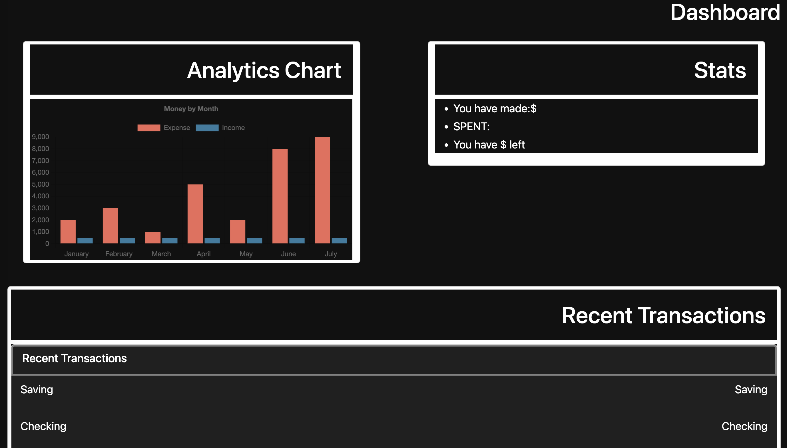
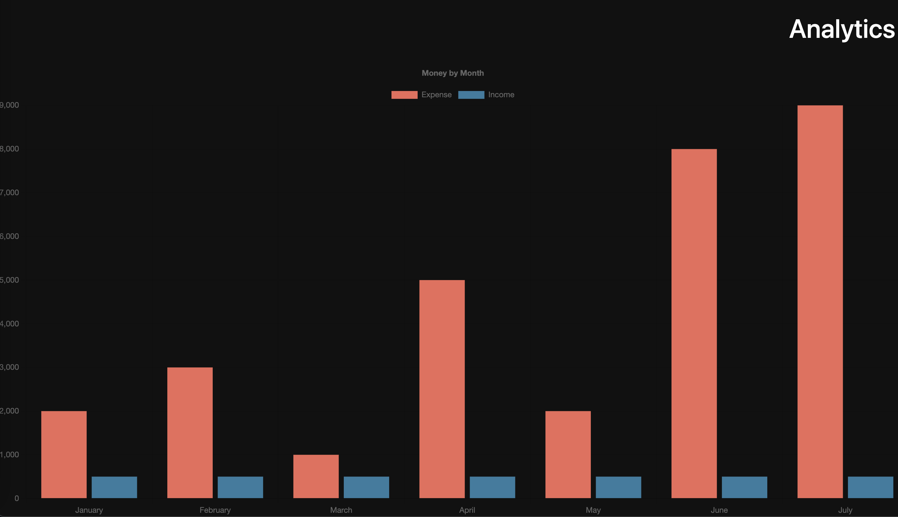
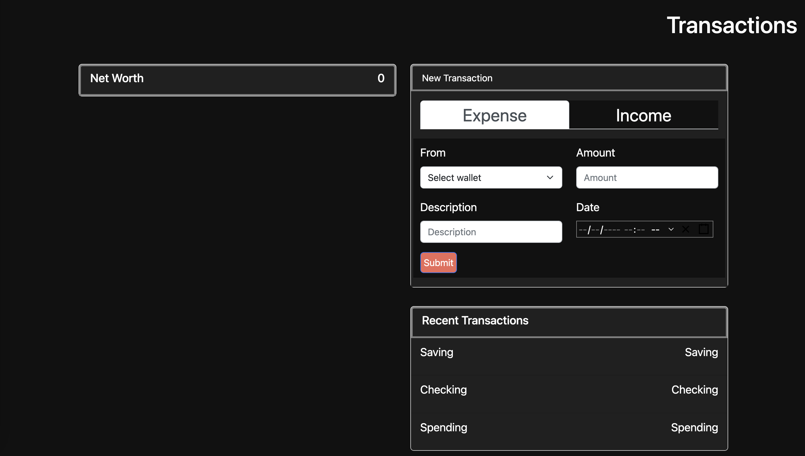

# Spend Sense

  ### Licenses
  * License Badge: 
  * Link for license Badge: https://opensource.org/licenses/MIT

  ### User Story
  AS a person who earns and spends money
  I WANT to have an app to track 
  SO THAT I can keep track of how I save and spend my money 

  ## TABLE OF CONTENTS
  * [Description](#description)
  * [Licenses](#licenses)
  * [Contribution](#contribution)
  * [Screenshot](#screenshot)

  ### Description
  Spend Sense is an expense tracking app that allows you to enter new transactions regarding your income or expenses. Spend Sense stores your data and displays it via cards, and charts to make a simple and clean visual of how your money is being managed.

  ### Licenses
  MIT

  ### Contribution
  Alex Griffitts, Clay Andemar, Cong Thanh Pham, Mugees Khaki

## Deployed
  [Link]()

  ### Screenshot
  
  
  
  